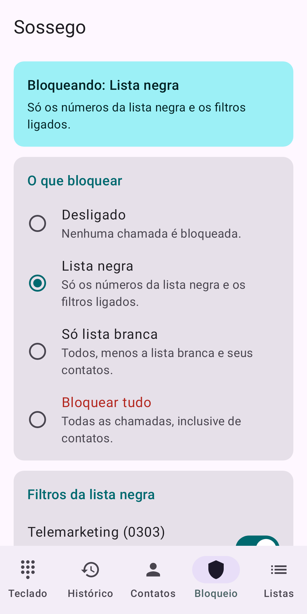
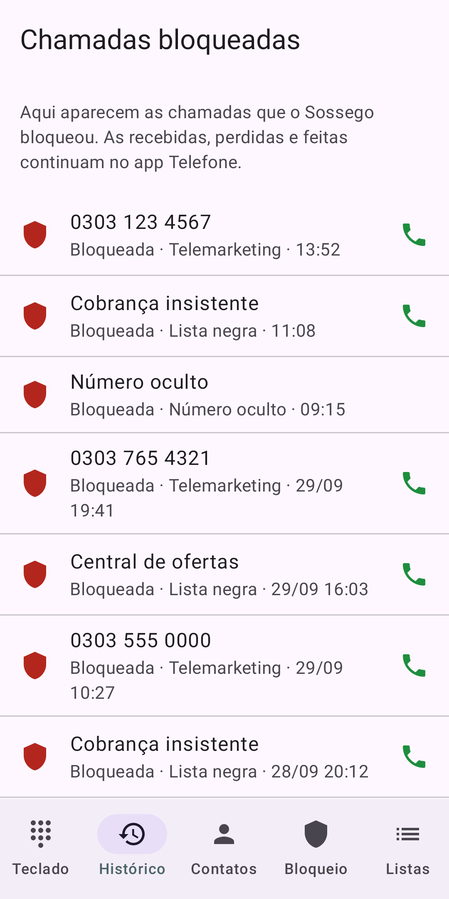
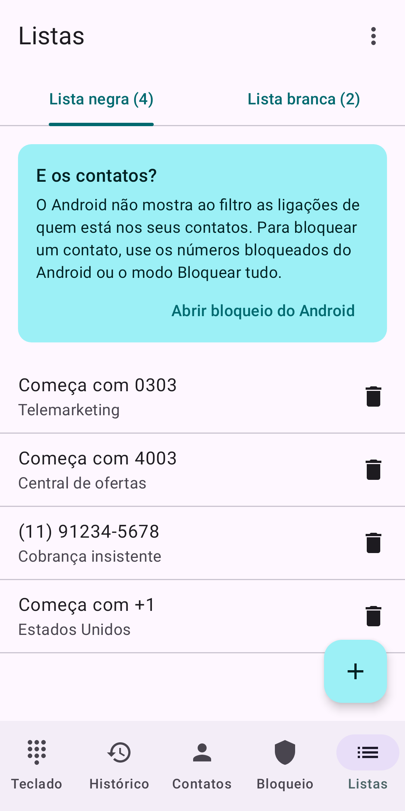
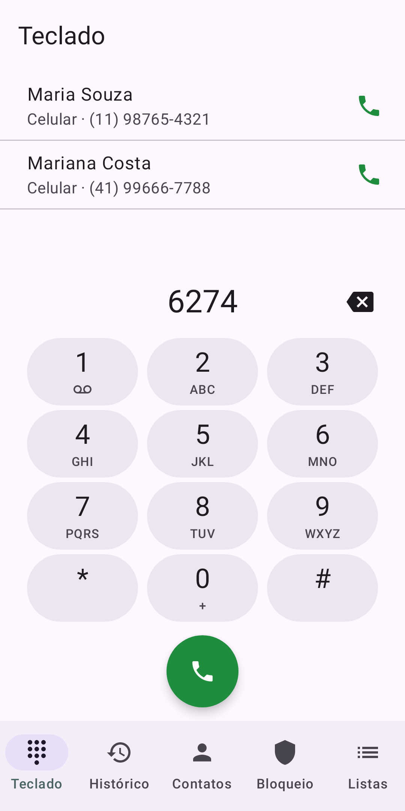
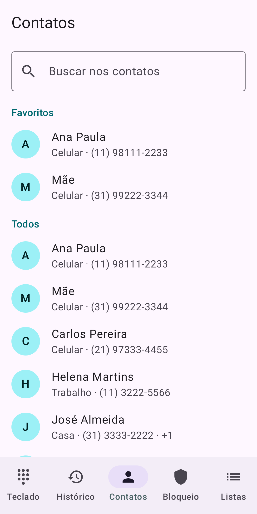

# Sossego – Bloqueio de Chamadas

Bloqueia chamadas indesejadas em silêncio: lista negra, só lista branca ou tudo. E liga pelo teclado, pelos contatos e pelo histórico. Grátis, sem anúncios, sem internet e sem coleta de dados.

<p>    </p>

## O que faz

- **Modos:** lista negra (padrão), só lista branca (contatos sempre passam), bloquear tudo, e outro modo num horário, por dia da semana.
- **Filtros:** telemarketing 0303 (ligado por padrão), números ocultos, ligações do exterior. Na lista branca, quem liga de novo em até 3 minutos passa.
- **Listas:** número exato ou "começa com", com nome; pelos contatos ou pelo histórico; exportar e importar em arquivo de planilha (`;`).
- **Ao bloquear:** recusar (padrão) ou silenciar; notificação nenhuma (padrão), a cada bloqueio ou resumo do dia; histórico com o motivo.
- **Ligar pelo app:** teclado com sugestão de contatos (6274 = MARIA), contatos, rediscar, caixa postal e escolha do chip.
- **Bloco nas Configurações rápidas** para ligar e desligar o bloqueio.

## Como funciona

O app usa o **filtro de chamadas** do Android (`CallScreeningService`, Android 10+), sem substituir o app Telefone. O Android não passa para esse filtro as ligações de contatos; por isso, no modo "bloquear tudo", o app recusa a chamada de um contato assim que ela começa a tocar (estado do telefone + `TelecomManager.endCall`). Qualquer erro deixa a chamada passar: um defeito nunca pode sumir com ligações. Os números brasileiros são comparados pelas regras de `core/` (+55, 0 + operadora, 0800/0303, nono dígito).

Duas versões, pelo sabor de compilação:

| Versão | Aba de histórico |
|---|---|
| `play` (Google Play) | Só as chamadas que o app bloqueou. A Play só libera o registro de chamadas para bloqueadores com um histórico comprovado de proteção, que um app novo não tem. |
| `full` (APK fora da loja) | Registro de chamadas do telefone (recebidas, perdidas, feitas) junto com os bloqueios. |

## Permissões

| Permissão | Quando é pedida | Para quê |
|---|---|---|
| Papel de filtro de chamadas | Ao ativar o bloqueio | Receber cada chamada antes de tocar |
| Contatos | Na lista branca, no teclado e na aba Contatos | Deixar contatos passarem e sugerir nomes |
| Estado do telefone, atender/recusar chamadas | Ao escolher "bloquear tudo" | Recusar contatos ao tocar |
| Fazer ligações | Ao ligar pelo app | Ligar direto, com a tela de chamada do celular |
| Notificações | Se você ligar as notificações | Avisar dos bloqueios |
| Registro de chamadas | Só na versão `full` | Mostrar todas as chamadas no histórico |

Não há permissão de internet. Política de privacidade: [PRIVACIDADE.md](PRIVACIDADE.md).

## Código

- `core/`: Kotlin puro: números brasileiros, listas, regras de decisão, horário, arquivo das listas, teclado, recentes e busca de contatos.
- `app/`: o app Android (Jetpack Compose): filtro, recusa ao tocar, banco SQLite, telas e bloco rápido.

Com o JDK do Android Studio (JBR), dentro desta pasta:

```sh
./gradlew :core:test :app:testPlayDebugUnitTest :app:testFullDebugUnitTest :app:lintPlayDebug :app:lintFullDebug
./gradlew :app:assembleFullDebug     # APK para instalar direto
./gradlew :app:bundlePlayRelease     # pacote da Google Play (assinado se houver keystore.properties, fora do Git)
./gradlew :app:testPlayDebugUnitTest --tests '*StoreImagesTest' --rerun -PstoreImages="$PWD/fastlane/metadata/android"   # imagens da loja
```

Plano, decisões, critérios de aceitação e testes no emulador: [PLANO.md](PLANO.md). Textos da loja: [fastlane/metadata/android/](fastlane/metadata/android/).

## Licença

[GPL-3.0](../LICENSE).

## In English

Sossego silently blocks unwanted calls: block list, allow list only, or everything, with a schedule, telemarketing/hidden/international filters and an optional notification. It also places calls from its own keypad, contacts and history. It uses Android's call screening role, so it works next to your Phone app. Free, no ads, no internet permission, no data collected. [Privacy policy](PRIVACIDADE.md#sossego-privacy-policy).
