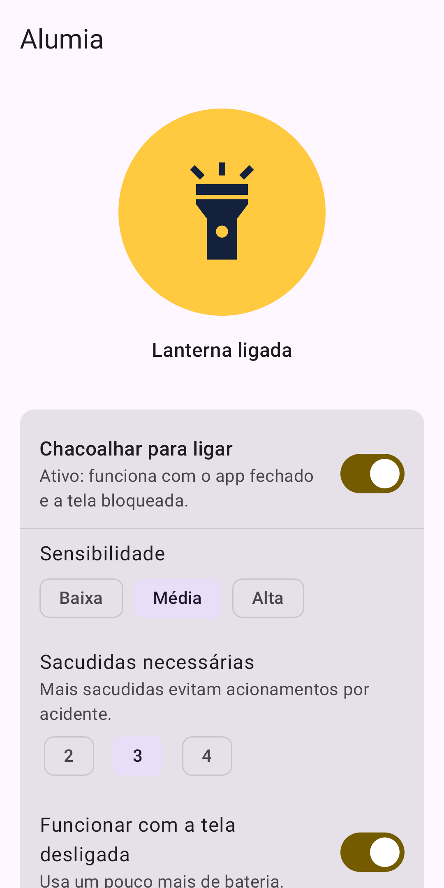
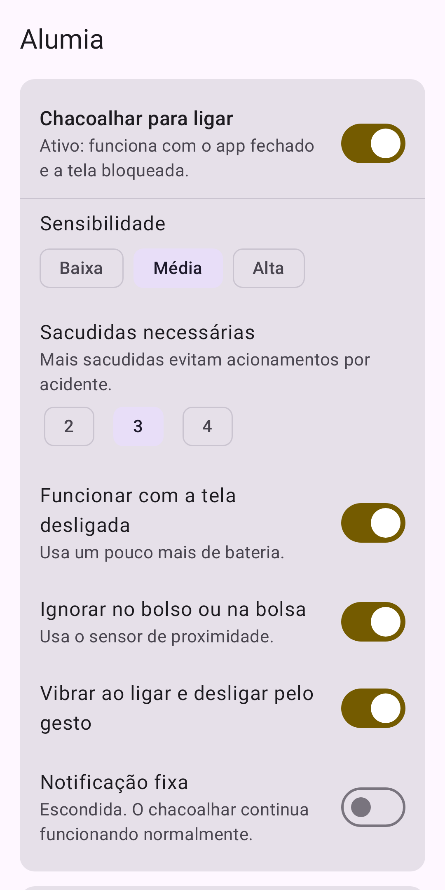
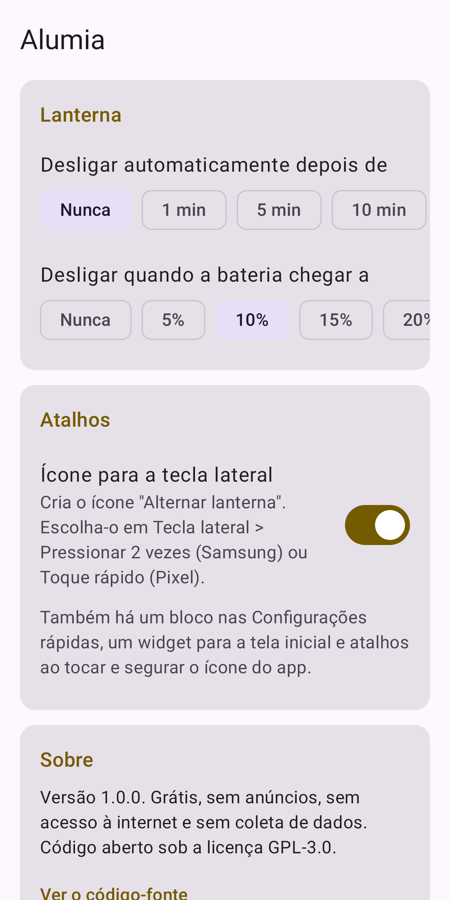

# Alumia – Lanterna no Gesto

Chacoalhe o celular para ligar e desligar a lanterna, mesmo com o app fechado e a tela bloqueada. Grátis, sem anúncios, sem internet e sem coleta de dados.

<p>  </p>

## O que faz

- **Chacoalhar para ligar:** sensibilidade baixa, média ou alta, e 2, 3 ou 4 sacudidas. Funciona com o app fechado, a tela bloqueada e, se você quiser, a tela desligada.
- **Sem acender por acidente:** ignora o gesto no bolso ou na bolsa (sensor de proximidade) e durante ligações, e espera 1,5 s entre um acionamento e outro.
- **Vibração** diferente ao ligar e ao desligar pelo gesto.
- **Desliga sozinha** depois de 1, 5, 10 ou 30 minutos, ou quando a bateria chega ao nível escolhido.
- **Atalhos:** bloco nas Configurações rápidas, widget, atalhos ao tocar e segurar o ícone, tecla lateral da Samsung (pressionar 2 vezes) e toque rápido do Pixel.
- **Intensidade** da luz no Android 13 ou mais novo, nos aparelhos que permitem.
- **Notificação fixa opcional:** o Android exige uma notificação para um app escutar sensores em segundo plano. A chave "Notificação fixa" leva à tela do Android que a esconde, e o chacoalhar continua funcionando.

## Permissões

| Permissão | Para quê |
|---|---|
| Serviço em primeiro plano (uso especial) | Escutar o acelerômetro com o app fechado e manter a luz acesa em segundo plano |
| Notificações | Mostrar a notificação com os botões, se você quiser |
| Iniciar com o celular | Voltar a escutar o chacoalhar depois de reiniciar |
| Vibração | Confirmar o gesto |
| Manter o processador ativo | Não perder o gesto com a tela desligada |

Não há permissão de internet. Política de privacidade: [PRIVACIDADE.md](PRIVACIDADE.md).

## Código

- `core/`: Kotlin puro, sem Android: o detector do gesto e as configurações, com testes.
- `app/`: o app Android (Jetpack Compose): serviço, lanterna, atalhos, widget e telas.

Com o JDK do Android Studio (JBR), dentro desta pasta:

```sh
./gradlew test lint assembleDebug    # testes, lint e APK de depuração
./gradlew :app:bundleRelease         # pacote da Google Play (assinado se houver keystore.properties, fora do Git)
./gradlew :app:testDebugUnitTest --tests '*StoreImagesTest' --rerun -PstoreImages="$PWD/fastlane/metadata/android"   # imagens da loja
```

Plano, decisões e status: [PLANO.md](PLANO.md). Textos da loja: [fastlane/metadata/android/](fastlane/metadata/android/).

## Licença

[GPL-3.0](../LICENSE).

## In English

Alumia turns the flashlight on and off when you shake your phone, even with the app closed and the screen locked: adjustable sensitivity and number of shakes, pocket detection, auto-off timer and low-battery cut-off, Quick Settings tile, widget and side-key shortcut. Free, no ads, no internet permission, no data collected. [Privacy policy](PRIVACIDADE.md#alumia-privacy-policy).
